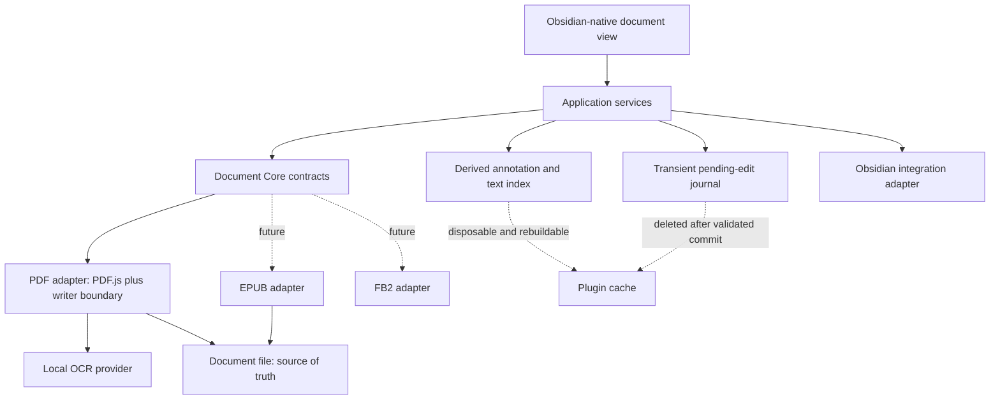

# Abyss Documents: Portable Document Reader and Annotation Design

**Status:** Revised design for user review

**Date:** 2026-08-09

**Initial platforms:** macOS, Windows, Linux, Android

**Architectural compatibility:** iOS and iPadOS must not be excluded by design

## 1. Product intent

Abyss Documents is an Obsidian-native document view that makes long-form reading, annotation, search, and linking feel like a built-in part of Obsidian. The document itself remains the source of truth. A PDF annotated in Abyss Documents must retain its annotations when opened and edited in interoperable readers such as Okular, then continue working when reopened in Obsidian.

The plugin must hide persistence and indexing complexity. A reader highlights, writes, draws, comments, links, tags, searches, and continues reading. There is no routine Save button and no status text explaining normal autosave behavior. `Ctrl+S` or `Cmd+S` forces an immediate flush when desired.

The first complete adapter is PDF. The architecture must permit later EPUB and FB2 adapters without allowing PDF.js-specific types to leak into the application or UI layers.

## 2. Non-negotiable principles

1. **Portable documents are authoritative.** Standard embedded document annotations and searchable text are the durable interoperable record. No Markdown sidecar is required for annotations. A private crash-recovery journal may temporarily protect acknowledged but unflushed edits; it is deleted after a validated document commit and is never treated as a user-facing knowledge store.
2. **Obsidian-native experience.** Controls use Obsidian components, CSS variables, Lucide icons, focus behavior, menus, tooltips, keyboard conventions, density, and active theme. The plugin must not look like a web application embedded inside Obsidian.
3. **Local-first operation.** Reading, editing, indexing, and OCR run locally. Any future network service requires explicit opt-in and disclosure.
4. **Complexity stays internal.** Saves, index refreshes, worker management, and normal background processing do not create UI noise. The user sees information only when it helps make a decision or resolve a failure.
5. **Long-document performance is a feature.** Opening a 700-page textbook must not render or index all pages eagerly, block the UI, or make annotation navigation sluggish.
6. **Capabilities are explicit.** A format adapter advertises what it can safely read, write, transform, search, and OCR. The interface omits unavailable actions by default. When a familiar action becomes unavailable for the current file, it is disabled with a short, plain-language reason rather than emulated using hidden proprietary storage.

## 3. Scope and delivery sequence

### Phase 1: production PDF reader

- Custom Obsidian view backed by a lazy-loaded PDF adapter.
- Virtualized page rendering and text layers.
- Outline navigation and editable page-number navigation.
- In-document search.
- Standard highlight, underline, strikeout, text, ink/stylus, and comment annotations where supported by the writer.
- Annotation colors, comments, transparent saving, conflict protection, and external-reader round trips.
- A user-invoked sidebar with outline, annotations, and search, hidden on initial document open.
- Reading appearance profiles.
- Desktop and Android behavior, with platform capability boundaries suitable for later iOS/iPadOS support.

### Phase 2: Obsidian semantic integration

- Wiki links and tags stored as plain text inside annotation comments.
- Obsidian-aware `[[` suggestions, aliases, and link resolution.
- Derived local index for annotation, link, tag, and color searches.
- A collapsed Related notes section inside the Annotations sidebar, with forward links and backlinks.
- Drag annotations into Markdown notes with a best-effort annotation deep link and a plain file-and-page fallback.

### Phase 3: local OCR

- Detection of missing or unusable PDF text layers.
- Current-page and whole-document OCR.
- Language selection, resumable progress, cancellation, and a capability-appropriate safe commit or copy.
- A standard invisible PDF text layer usable by other readers.

### Phase 4: additional formats

- EPUB reading preferences and standard embedded EPUB annotations when interoperability is proven.
- FB2 reading support first; write support remains disabled until a portable annotation representation is available.

Controls for later phases do not appear as disabled placeholders. Cloud OCR, collaboration services, proprietary annotation sidecars, and private Obsidian API patching are outside this design.

Implementation planning decomposes these phases further so risky persistence work does not hide inside a single “viewer” task: read-only viewing; core navigation and interaction; annotation reading; journaled annotation writes and conflict handling; interoperability qualification; semantic integration; then OCR. Each milestone ships or tests only controls whose capability is actually present.

## 4. System architecture



### 4.1 Document Core

Document Core owns application-level types and contracts. No consumer outside the PDF adapter imports PDF.js editor, page, annotation, or transport types.

Core contracts include:

- `DocumentAdapter`: identifies compatible files and opens a `DocumentSession`.
- `DocumentSession`: exposes metadata, outline, page/spine navigation, viewport rendering, text retrieval, search, annotation access, and capabilities.
- `AnnotationRepository`: creates, updates, transforms, deletes, lists, and navigates annotations using stable core identifiers.
- `DocumentWriter`: validates changes, flushes them, detects external modifications, and uses the strongest verified commit strategy available on the current vault adapter.
- `PendingEditJournal`: records accepted annotation operations before UI acknowledgement, replays them after an interrupted session, and clears them only after a validated document commit.
- `TextIndex`: incrementally indexes searchable text and annotation content and can be rebuilt from the document.
- `LinkResolver`: parses wiki links and tags, requests Obsidian suggestions, and resolves link targets without owning vault semantics.
- `OcrProvider`: reports availability, languages, progress, cancellation, and page results without coupling Core to a particular OCR engine.
- `CapabilitySet`: describes read, write, annotation-type, transform, search, stylus, theme, and OCR support for the current format and platform.

Stable annotation locators contain a document-relative identifier and position fallback. In PDF, the writer persists a stable standard annotation name where available. A page and geometric/text selector fallback allows recovery if another reader rewrites object references.

### 4.2 Application services

Application services orchestrate sessions without knowing file-format details:

- `DocumentSessionController` owns open/close, active page, selection, and view state.
- `AnnotationController` coordinates selection, popup editing, sidebar navigation, and save scheduling.
- `SearchController` exposes separate document-text and annotation-field searches over shared query, cancellation, highlighting, and navigation infrastructure.
- `DocumentLinkService` maintains the rebuildable link/tag index and exposes forward links and backlinks.
- `OcrJobController` runs bounded background OCR jobs and resumes interrupted jobs.
- `ReadingProfileService` resolves Auto, Light, Sepia, Dark, and Custom display profiles.
- `DragExportService` serializes an annotation into Markdown and its deep link.

Each service depends on contracts, not concrete adapters. Background work is cancellable and scoped to an open view or persisted resumable job.

### 4.3 Format adapters

The PDF adapter wraps PDF.js behind Document Core and may use a separate writer implementation for portable operations not exposed by PDF.js's public editor API. Updating PDF.js should require adapter tests and bundle changes, not UI changes.

PDF.js and its worker are separate lazy-loaded assets. They must not enter the plugin startup bundle, whose configured budget is 512 KiB. Worker and library versions must always match.

Future adapters must pass the same contract suite. The draft W3C EPUB Annotations representation in `META-INF/annotations.json` is a candidate, not a settled dependency; write support requires maturity and interoperability validation. FB2 annotation writes remain unavailable while other readers cannot be expected to preserve them.

## 5. PDF annotation model and interoperability

### 5.1 Stored data

The PDF stores standard annotation subtype, geometry, color, author/modification metadata, stable name, and plain-text contents. Comments may contain ordinary text, `[[Obsidian wiki links]]`, and `#tags`. These remain legible in third-party readers even when those readers do not interpret Obsidian syntax.

In the UI, **Text** means a visible FreeText annotation. A standalone **Comment** means a standard Text note; a comment attached to highlight, underline, strikeout, ink, or FreeText uses that annotation's standard contents field. Existing reply threads are preserved even when the first release cannot edit their hierarchy. A subtype or conversion is enabled only after round-trip fixtures prove geometry, contents, color, identity, and unrelated-object preservation in Abyss Documents, Okular, and Adobe Acrobat Reader; platform readers may add supplementary coverage.

Color meanings such as “Key idea” or “Question” are user preferences, not embedded semantic requirements. The PDF stores the standard color. The plugin maps that color to the configured label when rendering its UI.

The plugin may keep disposable indexes, thumbnails, worker state, and view preferences in plugin data. These are never the only durable copy of committed annotation content and can be deleted and rebuilt without losing committed document knowledge. A pending-edit journal is the narrow exception during the interval before a successful flush: it contains operations, not a parallel annotation database, and has the lifecycle defined in section 5.3.

### 5.2 Operations

- In the default Selection mode, selecting text only selects it for copy, lookup, or an explicit contextual action; it never mutates the PDF.
- When an annotation tool is explicitly active, selecting text creates that annotation type with the active color.
- Creating an annotation opens its compact editor. Merely navigating to or selecting an existing annotation does not interrupt reading; its editor opens through an explicit Edit action, double click, Enter, or the platform-equivalent gesture.
- Highlight, underline, and strikeout transformation is exposed only when the PDF writer can produce and validate a standard round-trippable result. The stable annotation identity and comment are preserved.
- Ink input uses pointer pressure where the platform provides it and remains usable with mouse or touch otherwise.
- External changes are detected using the file version captured when the session opened and when the last flush completed.

### 5.3 Saving and conflicts

Before an edit is acknowledged in the interface, its operation is appended to a small local recovery journal. Edits are then coalesced and flushed automatically after a short idle interval and when the view closes. `Ctrl+S` or `Cmd+S` requests an immediate flush. A validated commit clears the corresponding journal operations. On restart, valid pending operations are normally replayed without interruption; the user is asked only when recovery conflicts with a newer external revision. There is no Save button, autosave label, journal label, or routine success notice.

Before enabling edits, the writer preflights the file and vault adapter: encryption, edit permissions, certification, digital signatures, available binary-write operations, temporary-file support, and replacement guarantees. Signed or certified PDFs are read-only by default unless preservation has been proven. Restricted files and adapters without a verified safe in-place strategy offer **Save annotated copy** instead of pretending that the original can be updated safely.

For an editable file, the writer captures a strong revision digest, writes a temporary candidate where supported, validates that it opens and contains the intended changes, then rechecks the source digest immediately before commit. Replacement is described as atomic only on adapters where that behavior has been verified. Elsewhere the adapter uses its safest transactional sequence with a recoverable original or saves a new copy. A conflict never overwrites the newer source: it attempts annotation-level reconciliation, then offers plain choices to reopen the external file or save a recovered copy when automatic reconciliation is unsafe.

## 6. Fixed user interface contract

All product labels are concise, universal English. The calm reading surface is the default: only navigation, the current interaction mode, and immediately relevant state remain visible. Advanced tools use context, collapse, or overflow instead of permanent explanatory UI. Icon-only controls have Obsidian tooltips and accessible labels. Focus rings, keyboard order, menus, notices, buttons, inputs, and mobile hit targets follow Obsidian conventions.

Production UI must use Obsidian CSS variables and icon APIs. Hard-coded mockup colors are illustrative only. Reader-specific page colors are isolated inside the document canvas.

### 6.1 Top toolbar

The toolbar keeps this minimum visible in visual order appropriate to available width:

- sidebar toggle;
- previous-page button, editable current-page field, total-page count, and next-page button;
- current selection or annotation tool and, when relevant, its active color;
- one compact reading-profile entry on desktop;
- one standard Obsidian overflow entry.

The Obsidian tab header already identifies the document, so the toolbar does not repeat its name unless disambiguation is genuinely required. Pressing Enter in the page field navigates to the validated page. Annotation tools are icon-first rather than word buttons. Frequently used tools may be pinned on wide desktop layouts, but inactive tools, fit/zoom commands, healthy-document OCR, and other secondary actions live in overflow. OCR is promoted to a compact top-level entry only when recognition is recommended or running. Undelivered, unsupported, or irrelevant controls are absent rather than shown as placeholders. On narrow layouts, page navigation and the active tool stay reachable while reading profiles and all secondary tools move into overflow.

### 6.2 Single sidebar

There is one space-efficient sidebar, but it is hidden by default. A newly opened document initially shows the PDF reading surface and compact toolbar only. When explicitly opened, the sidebar contains three tabs:

- **Outline** shows the document outline and current location.
- **Annotations** shows virtualized annotation cards and annotation search.
- **Search** searches document text and navigates result snippets.

The sidebar opens only after an explicit user action: its toolbar toggle, a command such as **Show annotations**, or a direct search action such as `Ctrl`/`Cmd+F`. The triggering action selects the relevant tab. The presence of an outline, annotations, tags, links, or search index never opens it automatically, and following a deep link can navigate to an annotation without forcing the panel open.

The two search surfaces have explicit scopes rather than silently mixing result types: the Annotations field searches annotation quotes, comments, links, tags, colors, and meanings; the Search tab searches the document text layer. They share query, cancellation, highlighting, and navigation infrastructure internally. The sidebar can collapse using the normal Obsidian view affordance. It is not split into competing left and right rails. On phones it becomes a native-feeling overlay or sheet instead of permanently shrinking the page; selecting a destination returns focus to the document. Tablets may use the docked layout when space allows.

The plugin remembers the selected tab and desktop width for the next explicit opening, but not an always-open preference that changes the product-wide default. Restoring the exact same live Obsidian workspace leaf may preserve an already-open panel as session continuity; opening a new document view starts with it closed.

### 6.3 Annotation sidebar

Each annotation card is compact by default: it shows page/location, a short quote preview, a short comment preview only when present, and a non-color-only indication of the configured meaning. Full comments, rendered wiki links, tags, and secondary metadata appear for the active or explicitly expanded card. Clicking a card navigates the viewer and selects the matching annotation without opening the editor. When focus is in the annotation list, Up and Down select the previous or next annotation and keep sidebar and document positions synchronized; the keys retain their normal behavior in the document and comment editor.

The annotation search covers quotes, comments, resolved and unresolved wiki-link text, tags, page/location, and color meanings. Color-filter chips show the color, configured meaning, and count. A click isolates one color; modifier-click supports combining colors.

The Document tags and Related notes sections sit at the bottom and are collapsed by default. Expanding Document tags reveals tag search, counts, and multi-select filtering. Related notes shows forward links from annotations and backlinks from vault notes to the current document or annotation. Neither creates another rail or permanent panel.

### 6.4 Annotation popup

Creating an annotation or explicitly editing an existing annotation opens a small contextual popup near it. On phones the same editor uses an Obsidian-style bottom sheet so it does not clip or cover the selection. The editor contains:

- icon controls to convert among supported highlight, underline, and strikeout types;
- compact color swatches;
- a comment editor;
- a visible **Link** action;
- a visible **Tag** action.

Typing `[[` in the comment editor opens the same link-suggestion flow as pressing Link. Suggestions show note names, paths only when disambiguation is needed, and aliases. Candidate collection and resolution use supported Obsidian vault and metadata APIs rather than a separate raw scan. The plugin must never use private APIs to read hidden core settings. Exact mirroring of Obsidian's ignored/excluded-file rules is enabled when a supported public API exists. Until then, candidates are limited to supported Obsidian metadata sources and may be narrowed by plugin-owned exclusion patterns in Advanced settings; the plugin must not claim exact parity it cannot verify. Link insertion follows the user's Obsidian link-format preferences where exposed by supported APIs.

Tags are parsed from plain comment text and shown as interactive Obsidian-style pills without changing their portable stored representation.

### 6.5 Reading appearance

The toolbar exposes one compact reading-profile control with:

- **Auto**, following the active Obsidian light/dark theme;
- **Light**;
- **Sepia**;
- **Dark**;
- **Custom**.

Profiles alter rendering only. They do not rewrite the PDF, change embedded annotation colors, affect printing/export, or bake filters into pages. The renderer uses the least destructive supported technique and does not promise separation of text, vectors, and images when a page has already become a single canvas or raster scan. Structured pages may receive foreground and background treatment; raster pages fall back to whole-page tinting, dimming, or unchanged imagery. Images are never blindly inverted. Annotation overlays receive contrast treatment and a text/icon meaning so color is never their only signal.

Custom profiles expose only controls the current renderer can honor, such as page tint, brightness, contrast, and image dimming. A setting optionally remembers the last profile per document. The interface describes these as comfort adjustments, not color-faithful document transformations.

### 6.6 OCR menu

OCR uses one non-modal submenu. The entry stays in overflow for a healthy document and is promoted to the toolbar only when recognition is recommended or active:

- **Recognize document**;
- **Recognize current page**;
- **Recognition languages**;
- active job progress and cancellation when applicable.

When the text layer is healthy, manual OCR remains available without a badge. When sampled pages lack usable text, a small indicator suggests OCR without opening a dialog or blocking reading. Processing is identified as local in the menu details or first-run explanation, not repeated as persistent status text.

An active job reports page number and percentage in the same submenu. The last successful language choice is reused; language selection interrupts the launch only when no usable choice exists or the user opens it. Reading, navigation, and completed-page search remain available during processing. Job state is resumable after an Obsidian restart. Normal completion does not produce persistent UI noise; failures that need action use a concise Obsidian notice and a details action.

### 6.7 Drag and drop into notes

Dragging an annotation into a Markdown editor inserts a blockquote containing the quote, optional comment, and a best-effort deep link back to the annotation. A card menu exposes the same **Insert into active note** and **Copy citation** actions for touch and keyboard users. The default representation includes a plain file-and-page fallback and remains readable without the plugin:

```markdown
> Adaptive learning rates scale each parameter…
>
> Related to [[Gradient descent]].

[Open annotation](obsidian://abyss-documents/open?file=Deep%20Learning.pdf&page=438&annotation=pdf-nm-4f3a9c2e)
[[Deep Learning.pdf|Deep Learning.pdf]], p. 438 · #optimization
```

The exact deep-link representation is enabled only after a spike verifies supported Obsidian protocol or subpath registration on the platform. The plugin resolves it to the document, page, and annotation. If the exact link handler is unavailable, the standard file link and page number remain useful. If an external editor has regenerated identifiers, the locator fallback attempts page and selector recovery before reporting that the exact annotation is unavailable.

### 6.8 Settings organization

The settings tab takes organizational inspiration from [obsidian-task-calendar](https://github.com/flowing-abyss/obsidian-task-calendar) without copying a foreign visual skin. Native Obsidian `Setting` controls, spacing, typography, CSS variables, and current theme remain authoritative:

- icon-led, bordered, collapsible top-level sections;
- sections collapsed until needed, with open state preserved during rerender;
- concise title and explanatory text;
- palette meanings displayed as compact, reorderable, collapsible cards with a color dot, semantic label, and default-tool marker.

The sections are:

1. **Reading appearance**
2. **Annotation palette**
3. **Links & tags**
4. **OCR & languages**
5. **Advanced**

Controls do not duplicate routine toolbar actions. Settings define defaults and advanced behavior; the reader toolbar handles immediate reading choices.

### 6.9 Reading interaction and responsive behavior

Continuous scroll is the default. The current page changes when the viewport's reading anchor enters a new page, not on small boundary flicker. The plugin restores document position, zoom mode, selected sidebar tab, and sidebar width without announcing the restoration. Sidebar visibility follows the closed-by-default rule in section 6.2 rather than silently carrying an open workflow into a newly opened document.

Pinch zoom and platform-standard trackpad gestures work directly. `Ctrl`/`Cmd` plus wheel follows the user's platform convention; fit width, fit page, and numeric zoom live in overflow and commands rather than occupying permanent toolbar space. Temporary zoom feedback disappears automatically.

Pointer and touch selection use the standard selection mode until an annotation tool is explicitly active. Stylus input activates ink only through the chosen tool and must not turn ordinary finger scrolling into marks. Mobile controls use Obsidian-sized touch targets and safe-area spacing.

### 6.10 Accessibility and focus

- Toolbar tools expose name, pressed/selected state, shortcut, and disabled reason through accessible properties and tooltips.
- Color swatches include their semantic name; filters and cards never communicate meaning by color alone.
- The viewer exposes page landmarks and preserves text-layer reading order where the PDF provides one. The annotation list remains an accessible alternate route to marked content.
- Opening an annotation editor moves focus predictably; Escape closes it and returns focus to the originating annotation or selection.
- OCR progress and actionable failures use polite live announcements without repeatedly narrating every page.
- Reduced-motion preferences disable nonessential transitions and animated scrolling.
- Mobile color multi-selection has an explicit selectable mode; modifier-click is only a desktop shortcut.

## 7. Search, links, and derived indexing

PDF text and annotations are indexed incrementally. A stable document fingerprint identifies the document; a separate revision digest identifies the exact file version. After a plugin-authored write, known changed annotation or page records update incrementally. An arbitrary external rewrite triggers a full document-index rebuild unless the adapter can validate a reliable page-level diff. Page text extraction and indexing run in workers with bounded concurrency.

The public Obsidian API does not provide a supported way for a plugin to inject arbitrary PDF annotation records into the core Markdown metadata cache. Therefore, the plugin does not mutate internal cache structures or create hidden Markdown proxy notes. It provides native-styled document search and the collapsed **Related notes** section in the existing Annotations sidebar. That section presents links from annotations and backlinks from vault notes to document and annotation links.

Index loss never loses user data. Reopening or explicitly rebuilding reads the PDF and reconstructs annotation, link, tag, and text records.

## 8. OCR data flow

1. The PDF adapter samples text content and reports text-layer quality.
2. If quality is inadequate, the toolbar receives a non-blocking recommendation state.
3. The user selects current page or whole document; the last valid recognition languages are reused unless selection is required or explicitly opened.
4. `OcrJobController` renders pages at a bounded resolution and sends them to a local provider using limited worker concurrency.
5. Results are validated and accumulated into a new PDF text layer while preserving existing pages and annotations.
6. Completed pages become searchable in the current session.
7. At completion, the writer rechecks the source revision, opens the generated PDF for validation, and uses the preflighted safe commit strategy. Signed, restricted, or unsupported files produce a searchable copy rather than overwriting the source.
8. The derived index updates against the new file version.

Language resources are bundled or explicitly user-installed local assets. If a selected language requires a one-time download, the UI discloses its size and network use before fetching; recognition itself remains local. No model or page data is sent to a service by default.

## 9. Performance and resource behavior

- Plugin activation does not import PDF.js, OCR runtimes, or language models.
- Page canvases, text layers, and annotation layers are virtualized around the viewport and released outside a bounded buffer.
- Outline and annotation metadata load independently of page rendering.
- Search streams partial results and is cancellable.
- Annotation lists are virtualized and keyed by stable IDs.
- Save operations serialize through one document writer and coalesce rapid edits.
- OCR worker concurrency and render resolution adapt to platform memory and thermal constraints.
- Android uses larger hit targets and stricter memory limits; desktop may use additional workers.
- Platform checks use capabilities rather than desktop/mobile assumptions so later iPadOS support does not require architectural replacement.

Performance acceptance is measured with representative small documents, an image-heavy scan, and a versioned 700-page mixed-content textbook fixture. The benchmark manifest records hardware, OS, Obsidian/plugin versions, fixture hashes, and cold/warm conditions. Initial release targets on the designated reference devices are:

- plugin activation adds no eager PDF.js/OCR load and stays below 100 ms at p95;
- first usable PDF page appears within 2 seconds on reference desktop and 4 seconds on reference Android under the specified cold-start fixture;
- annotation-tool input reaches its visible overlay within 50 ms at p95;
- an already indexed search produces its first result within 300 ms at p95;
- rendered page layers remain bounded to the viewport plus a documented small buffer rather than growing with page count;
- continuous-scroll tests report long main-thread tasks, dropped-frame intervals, peak memory, and thermal/concurrency fallback rather than relying on visual judgment alone.

The quality gate also records background commit latency and OCR cancellation/resumption. A target may be revised only with an explicit benchmark report and product review; a silent baseline update cannot make a regression pass.

## 10. Failure handling

Normal background work is silent. Failures are classified by required user action:

- **Recoverable transient failure:** retry internally with bounded backoff; log diagnostic context.
- **Unsupported document operation:** normally omit the action; when the user reasonably expects it, disable it with plain language such as “This PDF can be viewed but not annotated,” followed by a concise reason or **Save annotated copy** action.
- **Save or external-edit conflict:** stop replacement, preserve both states, and offer safe recovery choices.
- **Corrupt generated PDF:** keep the original untouched, retain recoverable annotation changes, and provide retry/details.
- **OCR language unavailable:** explain the missing local resource and offer an explicit install action.
- **Memory pressure:** reduce render resolution/concurrency and continue; if impossible, pause the job with a resumable explanation.

Logs include operation, adapter, document fingerprint, page/annotation identifier, and underlying error without recording document contents.

## 11. Testing and verification

### 11.1 Contract and unit tests

- All adapters run a shared Document Core contract suite.
- Annotation parsing, stable locators, wiki links, tags, filters, color meanings, and drag serialization have focused unit tests.
- Search and index tests cover incremental invalidation, cancellation, and rebuild.
- Save tests cover journal-before-acknowledgement, replay and cleanup, coalescing, revision validation, external modification, verified atomic replacement, non-atomic adapter fallbacks, signed/restricted files, and recovery.
- OCR controller tests use a deterministic fake provider for progress, resume, cancellation, and failures.
- Settings tests verify collapsed sections, section state during rerender, palette ordering, and migration-safe defaults.

### 11.2 Interoperability fixtures

- Create and edit each supported annotation subtype in Abyss Documents.
- Open and edit fixtures in at least Okular and another established PDF reader.
- Reopen in Obsidian and verify geometry, color, comment, stable navigation, links, tags, and unsupported-object preservation.
- Run the reverse path for externally created annotations.
- Validate searchable OCR output with independent PDF text extraction.

### 11.3 End-to-end and visual tests

- Run the real-Obsidian desktop matrix and Android suite.
- Drive a running Obsidian instance through its CLI for plugin reload, DOM inspection, screenshots, console errors, and theme switching.
- Cover Light and Dark Obsidian themes, every built-in reading profile, narrow/mobile layouts, zoom levels, and long annotation lists.
- Exercise the PDF-only initial state, every explicit sidebar trigger, no automatic opening from document metadata or deep links, keyboard navigation and focus return, page entry, annotation Up/Down synchronization, selection without mutation, `[[` suggestions and documented exclusion fallbacks, Link/Tag actions, color filters, collapsed tags and related notes, drag/drop plus touch/keyboard insertion, `Ctrl/Cmd+S`, responsive sidebar/editor states, reading gestures, reduced motion, accessibility announcements, and OCR states.
- Capture screenshots for popup positioning, canvas/text-layer alignment, focus styles, menu clipping, and annotation contrast.

### 11.4 Development vault

A generated `dev-documents-vault/` contains deterministic PDF fixtures, long documents, scans, annotation round-trip samples, EPUB samples, and performance scenarios. The directory is ignored by Git; fixture generators and small legally distributable test assets remain versioned elsewhere as appropriate.

`pnpm run verify` remains the canonical repository quality gate. UI work is not considered complete until automated checks and manual Obsidian CLI verification both pass.

## 12. Fixed decisions and deferred decisions

### Fixed by this design

- Own Document Core with replaceable format adapters.
- PDF is first; EPUB follows; FB2 write support waits for interoperability.
- Standard in-document data is authoritative; there are no durable annotation sidecars, while a lifecycle-bound journal protects pending edits.
- One user-invoked sidebar with Outline, Annotations, and Search, hidden on new document views; tags and related notes are collapsed subsections rather than additional rails.
- Calm, icon-first English UI with editable page navigation, contextual tools, and no unavailable phase placeholders.
- Comments, Link and Tag actions, `[[` autocomplete, supported Obsidian metadata/link behavior, and an honest exclusion fallback without private APIs.
- Search across PDF text and annotation content.
- Color filters and configurable color meanings; tags collapsed by default.
- Synchronized annotation/document navigation.
- Transparent, journal-protected saving with `Ctrl/Cmd+S` force flush and safe-copy fallbacks for files that cannot be replaced safely.
- Auto, Light, Sepia, Dark, and Custom reading profiles.
- Compact contextual OCR menu with local processing and resumable progress, promoted only when relevant.
- Settings grouped as Obsidian-native collapsible sections and palette cards.
- Initial support for desktop platforms and Android without excluding iOS/iPadOS.

### Deferred to implementation planning or later phases

- Exact PDF writer mechanism for each annotation transform after official API and round-trip validation.
- Feasibility proof for custom annotation deep links, PDF-view registration, mobile commit strategies, and ignored-file integration through supported Obsidian APIs.
- Choice and packaging strategy for the local OCR engine and language assets.
- EPUB library selection and EPUB annotation interoperability matrix.
- iOS/iPadOS release timing after capability and memory testing.

These deferred choices may change adapter internals but may not weaken portability, local-first behavior, the fixed UI contract, or Obsidian-native integration.
