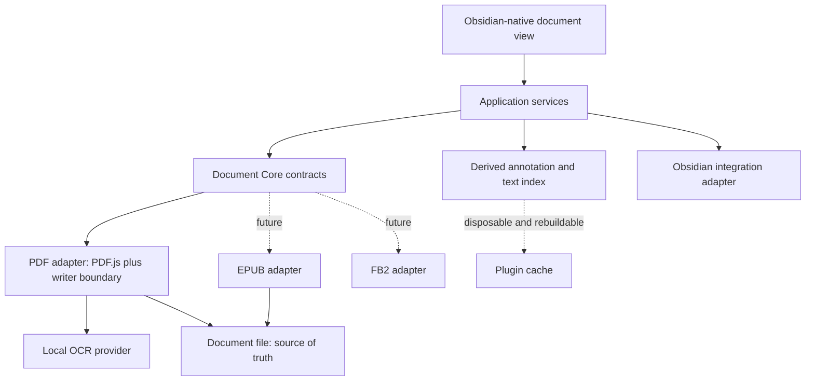

# Abyss Documents: Portable Document Reader and Annotation Design

**Status:** Approved design draft for user review

**Date:** 2026-08-09

**Initial platforms:** macOS, Windows, Linux, Android

**Architectural compatibility:** iOS and iPadOS must not be excluded by design

## 1. Product intent

Abyss Documents is an Obsidian-native document view that makes long-form reading, annotation, search, and linking feel like a built-in part of Obsidian. The document itself remains the source of truth. A PDF annotated in Abyss Documents must retain its annotations when opened and edited in interoperable readers such as Okular, then continue working when reopened in Obsidian.

The plugin must hide persistence and indexing complexity. A reader highlights, writes, draws, comments, links, tags, searches, and continues reading. There is no routine Save button and no status text explaining normal autosave behavior. `Ctrl+S` or `Cmd+S` forces an immediate flush when desired.

The first complete adapter is PDF. The architecture must permit later EPUB and FB2 adapters without allowing PDF.js-specific types to leak into the application or UI layers.

## 2. Non-negotiable principles

1. **Portable documents are authoritative.** Standard embedded document annotations and searchable text are the durable record. No Markdown sidecar is required for annotations.
2. **Obsidian-native experience.** Controls use Obsidian components, CSS variables, Lucide icons, focus behavior, menus, tooltips, keyboard conventions, density, and active theme. The plugin must not look like a web application embedded inside Obsidian.
3. **Local-first operation.** Reading, editing, indexing, and OCR run locally. Any future network service requires explicit opt-in and disclosure.
4. **Complexity stays internal.** Saves, index refreshes, worker management, and normal background processing do not create UI noise. The user sees information only when it helps make a decision or resolve a failure.
5. **Long-document performance is a feature.** Opening a 700-page textbook must not render or index all pages eagerly, block the UI, or make annotation navigation sluggish.
6. **Capabilities are explicit.** A format adapter advertises what it can safely read, write, transform, search, and OCR. Unsupported portable behavior is disabled with an explanation rather than emulated using hidden proprietary storage.

## 3. Scope and delivery sequence

### Phase 1: production PDF reader

- Custom Obsidian view backed by a lazy-loaded PDF adapter.
- Virtualized page rendering and text layers.
- Outline navigation and editable page-number navigation.
- In-document search.
- Standard highlight, underline, strikeout, text, ink/stylus, and comment annotations where supported by the writer.
- Annotation colors, comments, transparent saving, conflict protection, and external-reader round trips.
- Single sidebar with outline, annotations, and search.
- Reading appearance profiles.
- Desktop and Android behavior, with platform capability boundaries suitable for later iOS/iPadOS support.

### Phase 2: Obsidian semantic integration

- Wiki links and tags stored as plain text inside annotation comments.
- Obsidian-aware `[[` suggestions, aliases, and link resolution.
- Derived local index for annotation, link, tag, and color searches.
- Document Links panel with forward links and backlinks.
- Drag annotations into Markdown notes with a stable deep link.

### Phase 3: local OCR

- Detection of missing or unusable PDF text layers.
- Current-page and whole-document OCR.
- Language selection, resumable progress, cancellation, and atomic replacement.
- A standard invisible PDF text layer usable by other readers.

### Phase 4: additional formats

- EPUB reading preferences and standard embedded EPUB annotations when interoperability is proven.
- FB2 reading support first; write support remains disabled until a portable annotation representation is available.

Cloud OCR, collaboration services, proprietary annotation sidecars, and private Obsidian API patching are outside this design.

## 4. System architecture



### 4.1 Document Core

Document Core owns application-level types and contracts. No consumer outside the PDF adapter imports PDF.js editor, page, annotation, or transport types.

Core contracts include:

- `DocumentAdapter`: identifies compatible files and opens a `DocumentSession`.
- `DocumentSession`: exposes metadata, outline, page/spine navigation, viewport rendering, text retrieval, search, annotation access, and capabilities.
- `AnnotationRepository`: creates, updates, transforms, deletes, lists, and navigates annotations using stable core identifiers.
- `DocumentWriter`: validates changes, flushes them, detects external modifications, and performs atomic replacement.
- `TextIndex`: incrementally indexes searchable text and annotation content and can be rebuilt from the document.
- `LinkResolver`: parses wiki links and tags, requests Obsidian suggestions, and resolves link targets without owning vault semantics.
- `OcrProvider`: reports availability, languages, progress, cancellation, and page results without coupling Core to a particular OCR engine.
- `CapabilitySet`: describes read, write, annotation-type, transform, search, stylus, theme, and OCR support for the current format and platform.

Stable annotation locators contain a document-relative identifier and position fallback. In PDF, the writer persists a stable standard annotation name where available. A page and geometric/text selector fallback allows recovery if another reader rewrites object references.

### 4.2 Application services

Application services orchestrate sessions without knowing file-format details:

- `DocumentSessionController` owns open/close, active page, selection, and view state.
- `AnnotationController` coordinates selection, popup editing, sidebar navigation, and save scheduling.
- `SearchController` combines incremental document text search with annotation-field filters.
- `DocumentLinkService` maintains the rebuildable link/tag index and exposes forward links and backlinks.
- `OcrJobController` runs bounded background OCR jobs and resumes interrupted jobs.
- `ReadingProfileService` resolves Auto, Light, Sepia, Dark, and Custom display profiles.
- `DragExportService` serializes an annotation into Markdown and its deep link.

Each service depends on contracts, not concrete adapters. Background work is cancellable and scoped to an open view or persisted resumable job.

### 4.3 Format adapters

The PDF adapter wraps PDF.js behind Document Core and may use a separate writer implementation for portable operations not exposed by PDF.js's public editor API. Updating PDF.js should require adapter tests and bundle changes, not UI changes.

PDF.js and its worker are separate lazy-loaded assets. They must not enter the plugin startup bundle, whose configured budget is 512 KiB. Worker and library versions must always match.

Future adapters must pass the same contract suite. EPUB may use the standard `META-INF/annotations.json` representation after compatibility validation. FB2 annotation writes remain unavailable while other readers cannot be expected to preserve them.

## 5. PDF annotation model and interoperability

### 5.1 Stored data

The PDF stores standard annotation subtype, geometry, color, author/modification metadata, stable name, and plain-text contents. Comments may contain ordinary text, `[[Obsidian wiki links]]`, and `#tags`. These remain legible in third-party readers even when those readers do not interpret Obsidian syntax.

Color meanings such as “Key idea” or “Question” are user preferences, not embedded semantic requirements. The PDF stores the standard color. The plugin maps that color to the configured label when rendering its UI.

The plugin may keep disposable indexes, thumbnails, worker state, and view preferences in plugin data. These are never the only copy of annotation content and can be deleted and rebuilt without losing document knowledge.

### 5.2 Operations

- Selecting text creates the active annotation type with the active color.
- A selected annotation opens a compact editor for type, color, comment, link, and tag changes.
- Highlight, underline, and strikeout transformation is exposed only when the PDF writer can produce and validate a standard round-trippable result. The stable annotation identity and comment are preserved.
- Ink input uses pointer pressure where the platform provides it and remains usable with mouse or touch otherwise.
- External changes are detected using the file version captured when the session opened and when the last flush completed.

### 5.3 Saving and conflicts

Edits are coalesced and flushed automatically after a short idle interval and when the view closes. `Ctrl+S` or `Cmd+S` requests an immediate flush. There is no Save button, autosave label, or routine success notice.

Writes use a temporary sibling file, validate that the new PDF opens and contains the intended annotation changes, then atomically replace the original where the platform permits. The original is not replaced if the source changed externally. A conflict attempts a safe reload and annotation-level reconciliation; if automatic reconciliation is unsafe, the UI presents explicit choices to reopen the external file or save a separate recovered copy.

## 6. Fixed user interface contract

All product labels are concise, universal English. Icon-only controls have Obsidian tooltips and accessible labels. Focus rings, keyboard order, menus, notices, buttons, inputs, and mobile hit targets follow Obsidian conventions.

Production UI must use Obsidian CSS variables and icon APIs. Hard-coded mockup colors are illustrative only. Reader-specific page colors are isolated inside the document canvas.

### 6.1 Top toolbar

The toolbar contains, in visual order appropriate to available width:

- document name;
- previous-page button, editable current-page field, total-page count, and next-page button;
- selection/pointer tool;
- active highlight tool and visible active color;
- underline, ink, text, and other supported annotation tools as icons;
- compact OCR entry;
- compact reading-profile entry.

Pressing Enter in the page field navigates to the validated page. Annotation tools are icon-first rather than word buttons. On narrow layouts, less-used tools move into an overflow menu while page navigation and the active tool remain reachable.

### 6.2 Single sidebar

There is one space-efficient sidebar with three tabs:

- **Outline** shows the document outline and current location.
- **Annotations** shows virtualized annotation cards and annotation search.
- **Search** searches document text and navigates result snippets.

The sidebar can collapse using the normal Obsidian view affordance. It is not split into competing left and right rails.

### 6.3 Annotation sidebar

Each annotation card shows page/location, quoted text when present, comment, rendered wiki links, rendered tags, annotation color, and its configured meaning. Clicking a card navigates the viewer and selects the matching annotation. Moving with Up and Down selects the previous or next annotation and keeps sidebar and document positions synchronized.

The annotation search covers quotes, comments, resolved and unresolved wiki-link text, tags, page/location, and color meanings. Color-filter chips show the color, configured meaning, and count. A click isolates one color; modifier-click supports combining colors.

The Document tags section sits at the bottom and is collapsed by default. Expanding it reveals tag search, counts, and multi-select filtering without permanently consuming sidebar space.

### 6.4 Annotation popup

Creating or selecting an annotation opens a small contextual popup near it. The popup contains:

- icon controls to convert among supported highlight, underline, and strikeout types;
- compact color swatches;
- a comment editor;
- a visible **Link** action;
- a visible **Tag** action.

Typing `[[` in the comment editor opens the same link-suggestion flow as pressing Link. Suggestions show note names, paths when disambiguation is needed, and aliases. Candidate collection and resolution use supported Obsidian vault and metadata APIs, respect the user's excluded/ignored-file behavior, and never independently scan ignored files. Link insertion follows the user's Obsidian link-format preferences where exposed by supported APIs.

Tags are parsed from plain comment text and shown as interactive Obsidian-style pills without changing their portable stored representation.

### 6.5 Reading appearance

The toolbar exposes one compact reading-profile control with:

- **Auto**, following the active Obsidian light/dark theme;
- **Light**;
- **Sepia**;
- **Dark**;
- **Custom**.

Profiles alter rendering only. They do not rewrite the PDF, change embedded annotation colors, affect printing/export, or bake filters into pages. The renderer changes page background, foreground, contrast, and optional image dimming using the least destructive supported technique. It does not blindly invert images. Annotation overlays receive contrast treatment sufficient to preserve their configured meaning in every built-in profile.

Custom profiles expose page background, foreground, contrast, and image brightness. A setting optionally remembers the last profile per document.

### 6.6 OCR menu

OCR uses a compact toolbar icon and one non-modal submenu:

- **Recognize document**;
- **Recognize current page**;
- **Recognition languages**;
- active job progress and cancellation when applicable.

When the text layer is healthy, the icon remains visually quiet but manual OCR stays available. When sampled pages lack usable text, a small indicator suggests OCR without opening a dialog or blocking reading. The menu identifies processing as local.

An active job reports page number and percentage in the same submenu. Reading, navigation, and completed-page search remain available during processing. Job state is resumable after an Obsidian restart. Normal completion does not produce persistent UI noise; failures that need action use a concise Obsidian notice and a details action.

### 6.7 Drag and drop into notes

Dragging an annotation into a Markdown editor inserts a blockquote containing the quote, optional comment, and a stable Obsidian link back to the annotation. The default representation is readable without the plugin:

```markdown
> Adaptive learning rates scale each parameter…
>
> Related to [[Gradient descent]].

[[Deep Learning.pdf#annotation=pdf-nm-4f3a9c2e|Open annotation]] #optimization
```

The plugin resolves the fragment to the document, page, and annotation. If an external editor has regenerated identifiers, the locator fallback attempts page and selector recovery before reporting that the exact annotation is unavailable.

### 6.8 Settings organization

The settings tab follows the established visual language of the reference [obsidian-task-calendar](https://github.com/flowing-abyss/obsidian-task-calendar) plugin while using native Obsidian `Setting` controls:

- icon-led, bordered, collapsible top-level sections;
- sections collapsed until needed, with open state preserved during rerender;
- concise title and explanatory text;
- palette meanings displayed as compact, reorderable, collapsible cards with a color dot, semantic label, and default-tool marker.

The sections are:

1. **Reading appearance**
2. **Annotation palette**
3. **Links & tags**
4. **OCR & languages**
5. **Advanced**

Controls do not duplicate routine toolbar actions. Settings define defaults and advanced behavior; the reader toolbar handles immediate reading choices.

## 7. Search, links, and derived indexing

PDF text and annotations are indexed incrementally. The index is keyed by document fingerprint plus file modification state and invalidates only affected pages or annotation records. Page text extraction and indexing run in workers with bounded concurrency.

The public Obsidian API does not provide a supported way for a plugin to inject arbitrary PDF annotation records into the core Markdown metadata cache. Therefore, the plugin does not mutate internal cache structures or create hidden Markdown proxy notes. It provides native-styled document search and a **Document Links** view backed by its derived index. That view presents links from annotations and backlinks from vault notes to stable document-annotation links.

Index loss never loses user data. Reopening or explicitly rebuilding reads the PDF and reconstructs annotation, link, tag, and text records.

## 8. OCR data flow

1. The PDF adapter samples text content and reports text-layer quality.
2. If quality is inadequate, the toolbar receives a non-blocking recommendation state.
3. The user selects current page or whole document and confirms recognition languages.
4. `OcrJobController` renders pages at a bounded resolution and sends them to a local provider using limited worker concurrency.
5. Results are validated and accumulated into a new PDF text layer while preserving existing pages and annotations.
6. Completed pages become searchable in the current session.
7. At completion, the writer rechecks the source file, opens the generated PDF for validation, then atomically replaces the same file.
8. The derived index updates against the new file version.

Language resources are local assets. If a selected language requires a one-time download, the UI must disclose its size and network use before fetching; recognition itself remains local. No model or page data is sent to a service by default.

## 9. Performance and resource behavior

- Plugin activation does not import PDF.js, OCR runtimes, or language models.
- Page canvases, text layers, and annotation layers are virtualized around the viewport and released outside a bounded buffer.
- Outline and annotation metadata load independently of page rendering.
- Search streams partial results and is cancellable.
- Annotation lists are virtualized and keyed by stable IDs.
- Save operations serialize through one document writer and coalesce rapid edits.
- OCR worker concurrency and render resolution adapt to platform memory and thermal constraints.
- Android uses larger hit targets and stricter memory limits; desktop may use additional workers.
- Platform checks use capabilities rather than desktop/mobile assumptions so later iPadOS support does not require architectural replacement.

Performance acceptance is measured with representative small documents, an image-heavy scan, and a 700-page mixed-content textbook. The quality gate records activation time, time to first usable page, scroll responsiveness, search latency, memory growth, annotation-save latency, and OCR cancellation/resumption. Regressions require an explicit reviewed baseline update.

## 10. Failure handling

Normal background work is silent. Failures are classified by required user action:

- **Recoverable transient failure:** retry internally with bounded backoff; log diagnostic context.
- **Unsupported document operation:** disable the control and explain the adapter capability in a tooltip or menu description.
- **Save or external-edit conflict:** stop replacement, preserve both states, and offer safe recovery choices.
- **Corrupt generated PDF:** keep the original untouched, retain recoverable annotation changes, and provide retry/details.
- **OCR language unavailable:** explain the missing local resource and offer an explicit install action.
- **Memory pressure:** reduce render resolution/concurrency and continue; if impossible, pause the job with a resumable explanation.

Logs include operation, adapter, document fingerprint, page/annotation identifier, and underlying error without recording document contents.

## 11. Testing and verification

### 11.1 Contract and unit tests

- All adapters run a shared Document Core contract suite.
- Annotation parsing, stable locators, wiki links, tags, filters, color meanings, and drag serialization have focused unit tests.
- Search and index tests cover incremental invalidation, cancellation, and rebuild.
- Save tests cover coalescing, validation, external modification, atomic replacement, and recovery.
- OCR controller tests use a deterministic fake provider for progress, resume, cancellation, and failures.
- Settings tests verify collapsed sections, section state during rerender, palette ordering, and migration-safe defaults.

### 11.2 Interoperability fixtures

- Create and edit each supported annotation subtype in Abyss Documents.
- Open and edit fixtures in at least Okular and another established PDF reader.
- Reopen in Obsidian and verify geometry, color, comment, stable navigation, links, tags, and unsupported-object preservation.
- Run the reverse path for externally created annotations.
- Validate searchable OCR output with independent PDF text extraction.

### 11.3 End-to-end and visual tests

- Run the real-Obsidian desktop matrix and Android suite.
- Drive a running Obsidian instance through its CLI for plugin reload, DOM inspection, screenshots, console errors, and theme switching.
- Cover Light and Dark Obsidian themes, every built-in reading profile, narrow/mobile layouts, zoom levels, and long annotation lists.
- Exercise keyboard navigation, page entry, annotation Up/Down synchronization, `[[` suggestions, excluded files, Link/Tag actions, color filters, collapsed tags, drag/drop, `Ctrl/Cmd+S`, and OCR states.
- Capture screenshots for popup positioning, canvas/text-layer alignment, focus styles, menu clipping, and annotation contrast.

### 11.4 Development vault

A generated `dev-documents-vault/` contains deterministic PDF fixtures, long documents, scans, annotation round-trip samples, EPUB samples, and performance scenarios. The directory is ignored by Git; fixture generators and small legally distributable test assets remain versioned elsewhere as appropriate.

`pnpm run verify` remains the canonical repository quality gate. UI work is not considered complete until automated checks and manual Obsidian CLI verification both pass.

## 12. Fixed decisions and deferred decisions

### Fixed by this design

- Own Document Core with replaceable format adapters.
- PDF is first; EPUB follows; FB2 write support waits for interoperability.
- Standard in-document data is authoritative; no annotation sidecars.
- One sidebar with Outline, Annotations, and Search.
- Icon-first English UI with editable page navigation.
- Comments, Link and Tag actions, `[[` autocomplete, and Obsidian-aware ignored-file behavior.
- Search across PDF text and annotation content.
- Color filters and configurable color meanings; tags collapsed by default.
- Synchronized annotation/document navigation.
- Transparent saving with `Ctrl/Cmd+S` force flush.
- Auto, Light, Sepia, Dark, and Custom reading profiles.
- Compact contextual OCR menu with local processing and resumable progress.
- Settings grouped as Obsidian-native collapsible sections and palette cards.
- Initial support for desktop platforms and Android without excluding iOS/iPadOS.

### Deferred to implementation planning or later phases

- Exact PDF writer mechanism for each annotation transform after official API and round-trip validation.
- Choice and packaging strategy for the local OCR engine and language assets.
- EPUB library selection and EPUB annotation interoperability matrix.
- iOS/iPadOS release timing after capability and memory testing.

These deferred choices may change adapter internals but may not weaken portability, local-first behavior, the fixed UI contract, or Obsidian-native integration.
